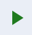

<a name="readme-top"></a>

<!-- PROJECT LOGO -->
<br />
<div align="center">
  <a href="https://github.com/Ikhor03/TokopediaPlay">
    
  </a>

<h3 align="center">Tokopedia Play Clone</h3>

  <p align="center">
    <br />
    <a href="https://tokopedia-play-dun.vercel.app/">Web Demo</a>
  </p>
</div>

<!-- ABOUT THE PROJECT -->

## About The Project

[![Product Name Screen Shot][product-screenshot]](https://tokopedia-play-dun.vercel.app/)

This project, crafted for my final exam in the Generasi Gigih program by [GoTo Impact Foundation](https://www.goto-impact.org/), was a thrilling challenge. Juggling this alongside two other projects within the same timeframe was no small feat. As I reflect, I'm intrigued by the myriad possibilities to enhance its functionality further. Your feedback matters! Connect with me on [LinkedIn](https://www.linkedin.com/in/imamkhoiri/) or [Instagram](https://www.instagram.com/ikhor03/) for insightful discussions. And if you're curious, don't miss exploring [the repository](https://github.com/Ikhor03/tokpedPlay) to uncover the API powering this creation.

<p align="right">(<a href="#readme-top">back to top</a>)</p>

### Built With

- [Create React App](https://github.com/facebook/create-react-app)
- [Joy-UI](https://mui.com/joy-ui/getting-started/)

### Feature

- list of clickable thumbnails
- Loading indicator
- Avatar shows random profile
- list of clickable products
- live Chat simulation
- Dark Mode

<p align="right">(<a href="#readme-top">back to top</a>)</p>

<!-- GETTING STARTED -->

## Getting Started

You can fork this repo

### Installation

1. Clone the repo
   ```sh
   git clone https://github.com/Ikhor03/Dapur-Solo-FE.git
   ```
2. Install and use the correct version of Node using [NVM](https://github.com/nvm-sh/nvm). And so you can install dependencies
   ```sh
   npm install
   ```
3. Start the development server

   ```sh
   npm start
   ```

<p align="right">(<a href="#readme-top">back to top</a>)</p>

<!-- MARKDOWN LINKS & IMAGES -->
<!-- https://www.markdownguide.org/basic-syntax/#reference-style-links -->

[product-screenshot]: public/tokpedplay-ss.png
[React.js]: https://img.shields.io/badge/React-20232A?style=for-the-badge&logo=react&logoColor=61DAFB
[React-url]: https://reactjs.org/
